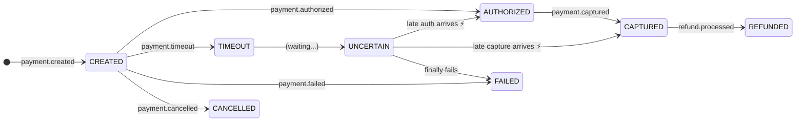
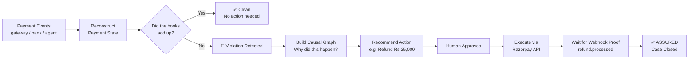
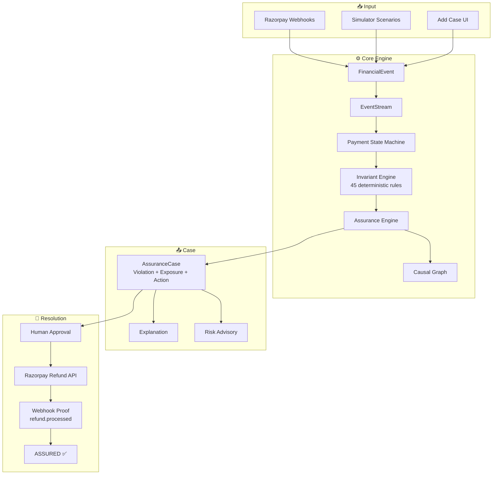
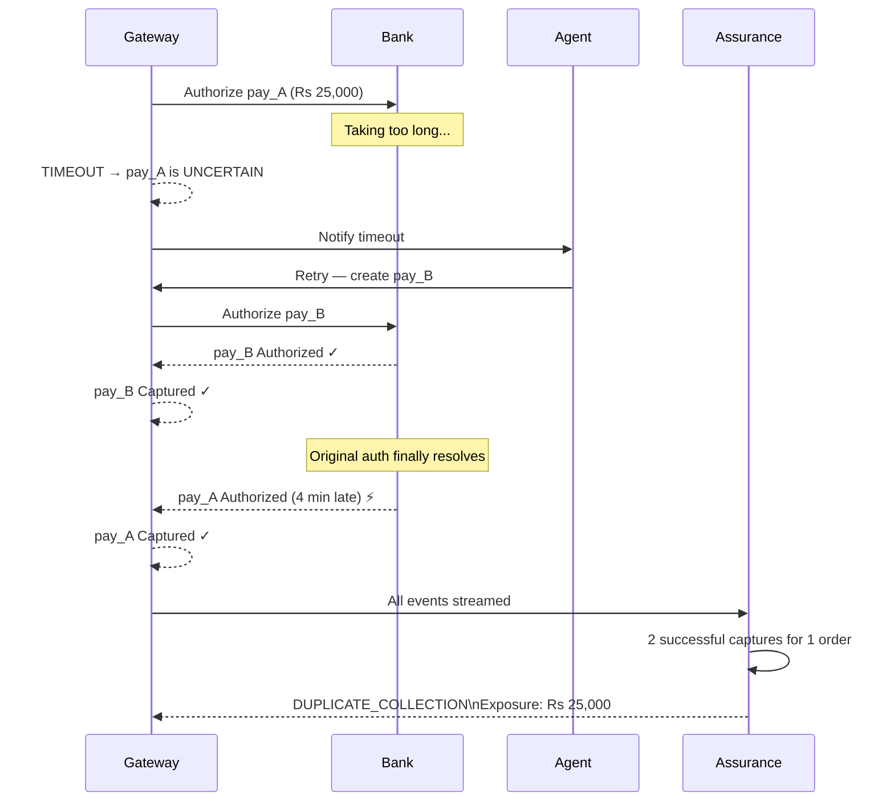
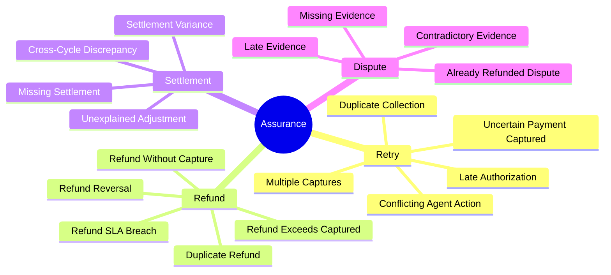
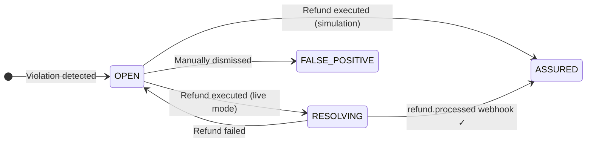
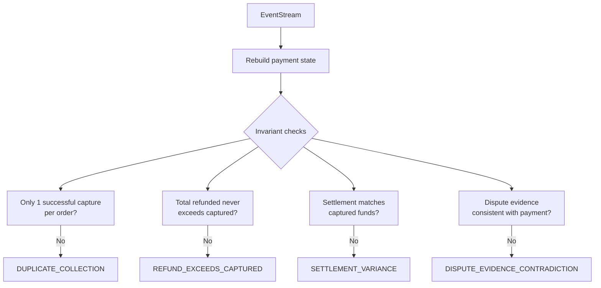

<div align="center">

# 🛡️ Assurance
### Financial Outcome Verification for Payment Systems

*Detects when money was collected twice. Explains why. Fixes it. Proves it was fixed.*

[](https://python.org)
[](https://fastapi.tiangolo.com)
[](https://react.dev)
[](backend/tests)
[](backend/simulator)

</div>

---

## 🧠 The Problem, in Plain English

Imagine a customer tries to pay Rs 25,000. The bank takes too long to respond — the gateway marks it as "timed out". Your system's recovery agent thinks the payment failed and automatically retries it. A second payment goes through successfully.

Then, 4 minutes later, the *original* payment also goes through.

**The customer has now been charged Rs 50,000 for a single order.**

No error was thrown. No alarm fired. Both banks said "success". The books just quietly disagreed.

This is a **late authorization after retry** — and it's extremely hard to catch automatically because every individual step was technically correct.

**Assurance catches it.** Then it explains exactly what happened, recommends a refund, and waits for proof that the customer's money was actually returned before marking the case resolved.

---

## 🔑 The Most Important Idea

> **A payment timeout is NOT a failure. It is uncertainty.**

Most systems treat `timeout = failed`. Assurance treats it as `UNCERTAIN` — because the bank might still authorize that payment later (and often does). This single distinction is what makes late-authorization duplicates detectable.



---

## 🎬 How It Works End-to-End



---

## 🏗️ Architecture



---

## 🚨 The Flagship Scenario



---

## 📊 What It Detects (45 Scenarios)



---

## ✅ Case Lifecycle



---

## 🧬 Why Deterministic Rules, Not Just ML?



If these math checks fail, there is a real financial problem — no probability, no threshold, no false positive risk from model drift. ML is used as an **advisory layer only**.

---

## 🧪 ML Validation (IEEE-CIS)

We validated a Random Forest trained on IEEE-CIS fraud data with a **chronological split** (train on older data, test on newer) to simulate real deployment:

| Metric | Random Split | Chronological Split |
|---|---|---|
| **ROC-AUC** | 0.83 | 0.76 |
| **Fraud Recall** | 0.64 | 0.47 |
| **Fraud Precision** | 0.13 | 0.11 |

The random split was giving us an overly optimistic picture. This is why ML is advisory only — the deterministic engine is the source of truth.

---

## 🚀 Getting Started

```bash
# Backend
cd backend
python -m venv .venv && .\.venv\Scripts\Activate.ps1
pip install -r requirements.txt
uvicorn main:app --reload
# → http://localhost:8000

# Frontend
cd frontend
npm install && npm run dev
# → http://localhost:5173

# Tests
cd backend
python -m pytest tests/ -v
# → 90 passed
```

---

## 📁 Project Structure

```
razorpay/
├── backend/
│   ├── app/
│   │   ├── models/event.py          # FinancialEvent, EventType (30+ types)
│   │   ├── state/payment.py         # PaymentStateMachine (TIMEOUT→UNCERTAIN)
│   │   ├── invariants/payment.py    # InvariantEngine, 45 violation checks
│   │   ├── engine.py                # AssuranceEngine (orchestrator)
│   │   ├── graph/causal.py          # Causal graph builder + chain extractor
│   │   ├── cases/assurance.py       # AssuranceCase lifecycle
│   │   ├── learning/memory.py       # OutcomeMemory, historical risk scoring
│   │   ├── ai/explainer.py          # Grounded explanation text
│   │   ├── connectors/              # Razorpay webhook verifier + API client
│   │   ├── db/                      # SQLAlchemy models, SQLite persistence
│   │   └── api/routes.py            # All API endpoints
│   ├── simulator/scenarios.py       # 45 deterministic scenario factories
│   └── tests/                       # 90 tests
├── frontend/
│   └── src/App.jsx                  # React dashboard
└── notebooks/
    └── external_behavior_training.ipynb  # IEEE-CIS ML validation
```

---

## 🌐 API Reference

| Method | Endpoint | Description |
|---|---|---|
| `GET` | `/health` | Liveness check |
| `GET` | `/scenarios` | All 45 scenarios with ground truth |
| `GET` | `/scenarios/{name}` | Run a named scenario |
| `POST` | `/assurance/cases` | Submit a custom event stream |
| `GET` | `/assurance/cases` | List all cases |
| `GET` | `/assurance/cases/{id}/timeline` | Chronological event evidence |
| `GET` | `/assurance/cases/{id}/graph` | Causal DAG for visualization |
| `GET` | `/assurance/cases/{id}/explanation` | Grounded explanation |
| `GET` | `/assurance/cases/{id}/audit` | Financial audit trail |
| `GET` | `/assurance/cases/{id}/risk` | Historical risk advisory |
| `POST` | `/assurance/cases/{id}/actions/refund` | Execute refund |
| `POST` | `/webhooks/razorpay` | Incoming provider webhook |

---

## ➕ Custom Event Streams

Paste any payment event sequence into the **+ ADD CASE** drawer:

```json
{
  "name": "My custom scenario",
  "amount_inr": 25000,
  "events": [
    {"event_type": "payment.created",    "payment_id": "pay_A", "amount": 2500000, "timestamp": "2026-09-02T10:00:00Z", "source": "gateway"},
    {"event_type": "payment.timeout",    "payment_id": "pay_A",                    "timestamp": "2026-09-02T10:00:05Z", "source": "gateway"},
    {"event_type": "agent.retry_initiated", "payment_id": "pay_A",                 "timestamp": "2026-09-02T10:00:30Z", "source": "agent"},
    {"event_type": "payment.created",    "payment_id": "pay_B", "amount": 2500000, "timestamp": "2026-09-02T10:00:34Z", "source": "agent"},
    {"event_type": "payment.authorized", "payment_id": "pay_B", "amount": 2500000, "timestamp": "2026-09-02T10:00:36Z", "source": "bank"},
    {"event_type": "payment.captured",   "payment_id": "pay_B", "amount": 2500000, "timestamp": "2026-09-02T10:00:37Z", "source": "gateway"},
    {"event_type": "payment.authorized", "payment_id": "pay_A", "amount": 2500000, "timestamp": "2026-09-02T10:04:12Z", "source": "bank"},
    {"event_type": "payment.captured",   "payment_id": "pay_A", "amount": 2500000, "timestamp": "2026-09-02T10:04:13Z", "source": "gateway"}
  ]
}
```

---

<div align="center">

**Assurance** — Because "the API returned 200" is not proof the customer got their money back.

*Razorpay Hackathon Project*

</div>
